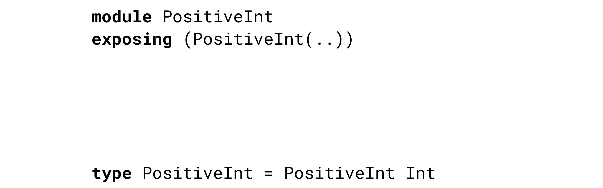
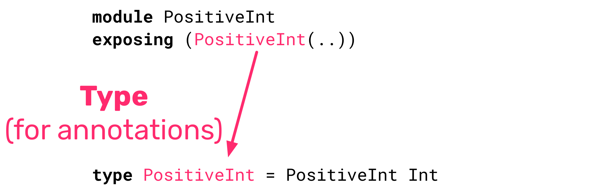
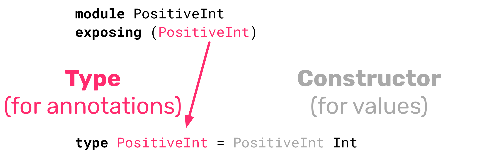

build-lists: true
slide-dividers: #

# Using Semantic Types to Squash Bugs

# The app

# The bug

# The bug from fixing the bug

- This isn't rocket science
- Trial and error

# Fix it, and keep it fixed

- Tests
- Code reviews
- Checklists

^ Tests only test what we remember to test
Manually check wrap early...
let's make it easier

# Rule of thumb

- Wrap early
- Unwrap late
- But it's a String whether it's wrapped or not

# Tip

Use types to represent what the thing is.

- Semantic types!
- Cheap to start with
- Good stepping stone

# Can't we just fix it?

- We could!
- If I can eliminate a class of errors, I want to!

# Goal

1. Change the type in a single place
1. Address all of the compiler errors
1. End up with the bug fixed

# Evolving our type

1. Primitives
1. Type with public constructor

# Problem

- Okay, that made it easier to unwrap late
- Can I make it impossible?

# Opaque Types

- Just means "private constructor"
  1. Move to module
  1. Hide the constructor
  1. (But expose the type for annotations)
  1. Make functions for using it

# -

# -

# -

# -

# -

# Continuing down the path

1. Primitives
1. Type with public constructor
1. Move to module
1. Use accessors instead of constructor
1. "One-stop-shop" (no accessors)

- Invert responsibility
